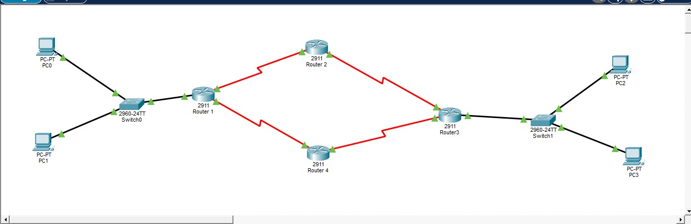

# Diamond Topology: Redundant Network with OSPF Routing

## 📌 Project Overview
This project demonstrates a high-availability network architecture using a **Diamond Topology** to ensure redundant communication between two Local Area Networks (LANs). By implementing **OSPF (Open Shortest Path First)**, the network dynamically calculates the most efficient path for data and provides automatic failover if a link or router goes down.

## 🚀 Objective
The primary goal was to establish a fail-proof connection between the **Left LAN (192.168.10.0/24)** and the **Right LAN (192.168.20.0/24)**. The design ensures that traffic can bypass failures by rerouting through alternate paths (Top or Bottom) without manual intervention.

## 🏗️ Topology Architecture
The network consists of four Cisco 2911 routers and two 2960 switches arranged in a diamond shape:
* **Router 1 (Gateway):** Connects the Left LAN to the backbone.
* **Router 2 & 4 (Mid-Backbone):** Provide redundant paths for traffic.
* **Router 3 (Gateway):** Connects the Right LAN to the backbone.

## 🖼️ Topology Diagram

## 🔢 Logical IP Addressing Scheme
To simplify troubleshooting and documentation, a consistent **10.A.B.x** addressing scheme was used for all serial backbone links:
* **Format:** `10.[Router A].[Router B].x`
* **Examples:**
    * Link between R1 and R2: `10.1.2.0/30`
    * Link between R1 and R4: `10.1.4.0/30`
    * Link between R2 and R3: `10.2.3.0/30`
    * Link between R4 and R3: `10.4.3.0/30`

This logic makes the network self-documenting; looking at an IP immediately identifies its source and destination routers.

## ⚙️ Key Technical Features
* **OSPF Area 0:** Implemented as a single-area backbone for rapid convergence and dynamic route discovery.
* **30-bit Subnetting:** Used `/30` masks (`255.255.255.252`) on point-to-point serial links to maximize address efficiency and minimize waste.
* **Wildcard Masking:** Calculated inverse masks (e.g., `0.0.0.3`) for precise OSPF network advertisements.
* **Path Redundancy:** OSPF automatically detects link failures and reroutes traffic, maintaining a 100% uptime for end-to-end communication.

## 🛠️ Verification & Testing
To confirm the network is fully operational, perform the following checks:
1. **Adjacency Check:** Run `show ip ospf neighbor` to ensure all routers are in the `FULL` state.
2. **Routing Table:** Run `show ip route` to verify OSPF-learned routes (marked with **'O'**).
3. **Connectivity:** Ping from **PC0** (`192.168.10.10`) to **PC2** (`192.168.20.10`).
4. **Path Trace:** Use `tracert` to identify whether data is traversing the top (R2) or bottom (R4) path.

